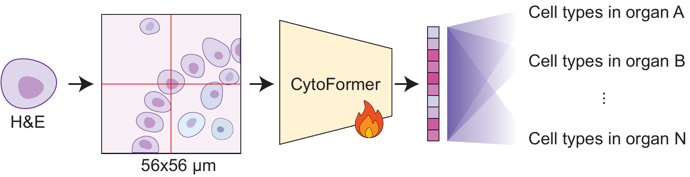
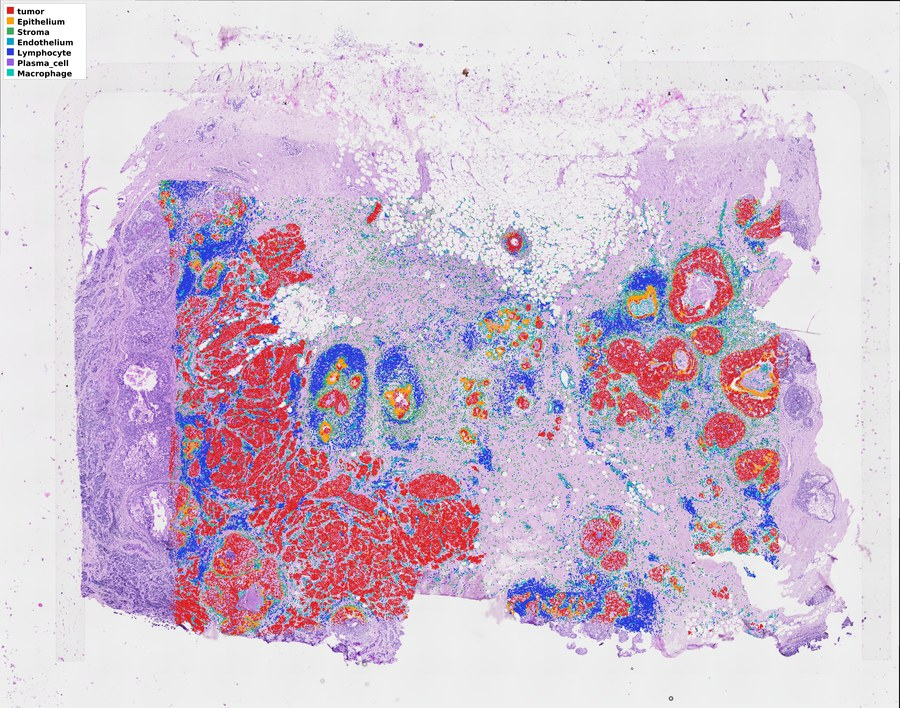
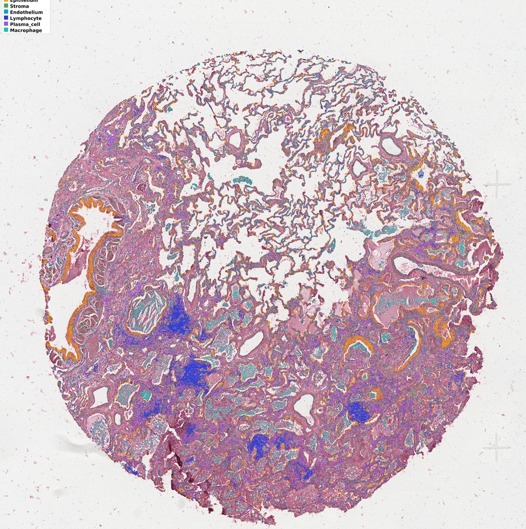

# CytoFormer

Inference code for **CytoFormer**, a cell foundation model that assigns a cell type to every
nucleus on a routine H&E slide. The model was trained on 15.4 million cells from 81 paired
Xenium / H&E sections across 16 organs, using cell types derived from the spatial transcriptome
rather than from manual annotation.

This repository contains the model definition and the inference pipeline. The trained weights are
released separately on Hugging Face.

---

## Model



A 56 × 56 µm crop centred on a nucleus is encoded by a ViT-giant transformer; the organ selects one
of 16 linear heads, which predicts a cell type among the cell types of that organ.

| | |
|---|---|
| **Input** | one 56 µm field of view centred on the nucleus, resized to 224×224 px |
| **Encoder** | ViT-giant, patch 14, 1536-d embedding, initialised from UNI2-h and fine-tuned end-to-end |
| **Head** | 16 linear classifiers, one per organ, each over that organ's cell types only (103 outputs in total); the organ identifier selects which head is used and is **not** given to the encoder |
| **Output** | one of 23 global cell types, restricted to the cell types that occur in the given organ |

The organ is a routing signal, not an image feature: the same representation is produced whatever
organ is declared, so the encoder can be reused as a general cell-level feature extractor.

`cytoformer/model.py` defines `CellClassifier`; `cytoformer/common.py` holds the encoder builder,
the taxonomy and `PerOrganHead`.

---

## Sample data and predictions

Two held-out slides can be browsed online. Every nucleus inside the tissue was segmented with
StarDist and then typed by CytoFormer, so the overlay covers the whole section.
**Click either image to open the viewer:**

| | |
|:---:|:---:|
| [](https://zhihuanglab.github.io/CytoFormer/) | [](https://zhihuanglab.github.io/CytoFormer/) |
| **Breast**, 186,476 nuclei | **Lung**, 124,743 nuclei |

**https://zhihuanglab.github.io/CytoFormer/**

Pan and zoom as in a slide viewer and switch between the overlay and the slide as scanned. The
prediction can be shown for every nucleus on the slide or restricted to the cells Xenium segmented
and kept, and a second panel opens on the right with the reference cell types derived from the
paired spatial transcriptome.

---

## Organs and cell types

| organ | cell types |
|---|---|
| bone | Bone_cell, Endothelium, Lymphocyte, Stroma |
| bone_marrow | Endothelium, Erythroid, Myeloid_progenitor, Neutrophil, Stroma |
| brain | Endothelium, Microglia, tumor |
| breast | Endothelium, Epithelium, Lymphocyte, Macrophage, Plasma_cell, Stroma, tumor |
| cervix | Endothelium, Epithelium, Lymphocyte, Macrophage, Plasma_cell, Stroma, tumor |
| colon | Endothelium, Epithelium, Lymphocyte, Macrophage, Plasma_cell, Stroma, tumor |
| heart | Cardiomyocyte, Endothelium, Macrophage, Stroma |
| kidney | Endothelium, Lymphocyte, Macrophage, Plasma_cell, Renal_tubule, Stroma, tumor |
| liver | Cholangiocyte, Endothelium, Hepatocyte, Lymphocyte, Macrophage, Stroma, tumor |
| lung | Chondrocyte, Endothelium, Epithelium, Lymphocyte, Macrophage, Plasma_cell, Stroma, tumor |
| lymph_node | Endothelium, Lymphocyte, Macrophage, Plasma_cell, Squamous_epithelium, Stroma, tumor |
| ovary | Endothelium, Epithelium, Lymphocyte, Macrophage, Plasma_cell, Stroma, tumor |
| pancreas | Acinar, Ductal, Endothelium, Islet, Lymphocyte, Macrophage, Plasma_cell, Stroma, tumor |
| prostate | Endothelium, Epithelium, Lymphocyte, Macrophage, Nerve, Stroma, tumor |
| skin | Endothelium, Epithelium, Lymphocyte, Macrophage, Plasma_cell, Stroma, melanocytic, tumor |
| tonsil | Endothelium, Epithelium, Lymphocyte, Macrophage, Plasma_cell, Stroma |

The full mapping is in `cytoformer/organ_celltype_map.json`.

---

## Install

```bash
git clone https://github.com/zhihuanglab/CytoFormer
cd CytoFormer
pip install -r requirements.txt
```

Download the checkpoint and put it next to `organ_celltype_map.json`:

```bash
mkdir -p checkpoints && cp cytoformer/organ_celltype_map.json checkpoints/
hf download zhihuanglab/CytoFormer checkpoint.pth --local-dir checkpoints
```

The checkpoint contains the whole network, so the UNI2-h foundation weights are **not** needed for
inference.

---

## Usage

### 1. Crop one patch per cell

Write one 224×224 PNG per cell from a whole-slide image and a table of nucleus centroids in that
slide's pixel frame (`cells.csv` needs the columns `x`, `y`, optionally `cell_id`):

```bash
python scripts/crop_cells.py --wsi slide.ome.tif --cells cells.csv --mpp 0.25 --out patches/
```

`--mpp` is the slide's micrometres per pixel at level 0, which sets how many pixels the 56 µm
window spans before the patch is resized to 224 px. `--fov_um` changes the field of view (56 µm is
what the model was trained with).

### 2. Predict

```bash
python scripts/infer.py \
    --model_dir checkpoints \
    --patches   patches/ \
    --organ     skin \
    --out       preds.parquet
```

`--organ` must be one of the 16 organs above; predictions are restricted to that organ's cell
types. `--patches` also accepts a list of image files. Add `--batch` to change the batch size
(default 256). The script uses a GPU when one is available and falls back to CPU otherwise.

Output (`preds.parquet`):

| cell_id | file | organ | pred_celltype | prob |
|---|---|---|---|---|
| c0 | c0.png | skin | tumor | 0.9731 |
| c1 | c1.png | skin | Lymphocyte | 0.8442 |

`cell_id` is the image file stem, so predictions join straight back onto your input table.

### From Python

```python
import torch
from cytoformer import CellClassifier, ORGAN_IDX

net = CellClassifier()
net.load_state_dict(torch.load("checkpoints/checkpoint.pth", map_location="cpu"))
net.eval()

x = torch.randn(2, 3, 224, 224)                                # ImageNet-normalised patches
organ = torch.tensor([ORGAN_IDX["skin"]] * 2)
logits = net(x, organ)                                         # (2, 23), out-of-organ classes masked
emb = net.extract_features(x)                                  # (2, 1536) cell embedding
```

`extract_features` returns the cell embedding, which is what we use in the linear-probing and
active-learning experiments in the paper.

---

## Layout

```
cytoformer/          the package
  model.py           CellClassifier: encoder + per-organ head
  common.py          encoder builder, taxonomy, PerOrganHead
  organ_celltype_map.json
scripts/
  crop_cells.py      WSI + centroids -> 224x224 cell patches
  infer.py           patches -> predicted cell types
assets/              figures used in this README
docs/                the online sample viewer (GitHub Pages)
```

## Contact

For questions or suggestions, please contact: [zhi.huang@pennmedicine.upenn.edu](mailto:zhi.huang@pennmedicine.upenn.edu)
